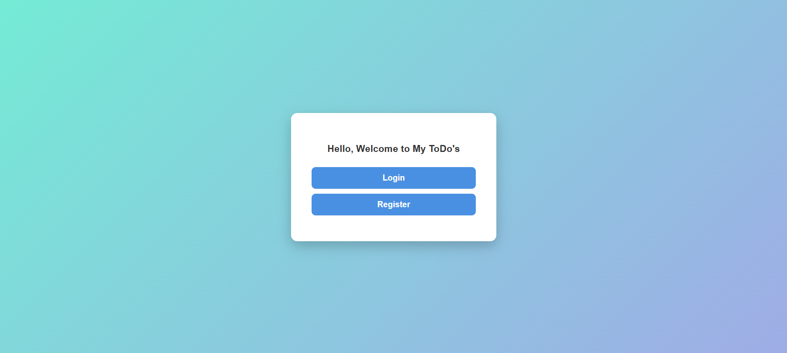
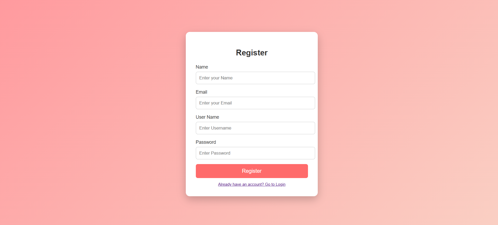
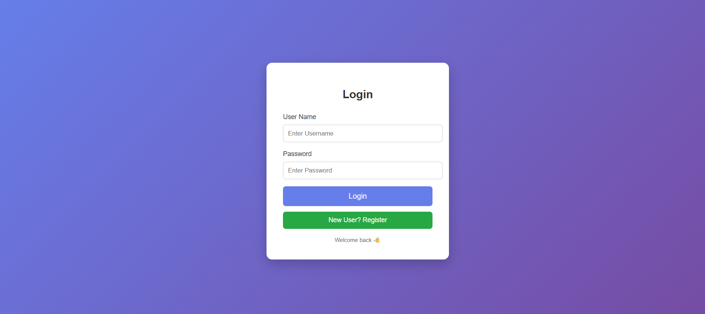

# 📝 MyToDos - Java Web Application


---

## 🚀 Overview

**MyToDos** is a full-stack Java web application that helps users manage their daily tasks efficiently.  
It is built using **Servlets, JSP, and JDBC** following the **MVC architecture pattern**.

This project demonstrates backend development skills including:
- Authentication system
- CRUD operations
- Database integration
- MVC design pattern

---

## ✨ Features

- 🔐 User Registration & Login system
- ➕ Add new tasks
- 📋 View all tasks
- 🗑️ Delete tasks
- 💾 Persistent storage using MySQL
- 🌐 Dynamic web pages using JSP

---

## 🛠️ Tech Stack

| Layer        | Technology |
|--------------|------------|
| Frontend     | HTML, CSS, JSP |
| Backend      | Java Servlets |
| Database     | MySQL |
| Server       | Apache Tomcat |
| Architecture | MVC Pattern |

---

## 📁 Project Structure
```text
MyToDos/
│
├── src/main/java/
│ ├── controller/
│ │ ├── LoginController.java
│ │ ├── Logout.java
│ │ ├── RegisterationController.java
│ │ └── ToDoServlet.java
│ │
│ └── model/
│ ├── ToDo.java
│ ├── ToDos.java
│ └── dbConnection.java
│
├── src/main/webapp/
│ ├── WEB-INF/
│ ├── META-INF/
│ ├── index.html
│ ├── login.html
│ ├── Registeration.html
│ └── tasks.jsp
│
├── .gitignore
└── README.md
```

## 📸 Screenshots

### 🏠 Home Page



### 📝 Registration Page



### 🔐 Login Page



## 🔧 Installation & Setup

### 1. Clone the Repository

```bash
git clone https://github.com/ahmad-ayaan/MyToDos.git
```

### 2. Open in IDE

Import the project into:

* Eclipse IDE
* IntelliJ IDEA
* NetBeans

### 3. Configure Database

* Install MySQL
* Create the database
* Update JDBC credentials

For detailed instructions, see [DATABASE_SETUP.md](DATABASE_SETUP.md).

### 4. Deploy on Apache Tomcat

Add the project to Tomcat and start the server.

### 5. Run the Application

Open your browser and navigate to:

```text
http://localhost:8080/MyToDos
```

---

## 🎯 Learning Outcomes

This project helped me gain practical experience with:

* Java Servlet Development
* JSP Pages
* JDBC Connectivity
* MySQL Integration
* MVC Architecture
* Session Management
* Authentication & Authorization
* CRUD Operations
* Web Application Development

---

## 🔮 Future Improvements

* Edit / Update Tasks
* Task Categories
* Due Dates and Reminders
* Responsive UI Design
* Search and Filter Tasks
* REST API Integration
* Docker Deployment

---

## 🤝 Contributing

Contributions, suggestions, and improvements are welcome.

1. Fork the repository
2. Create a feature branch

```bash
git checkout -b feature-name
```

3. Commit your changes

```bash
git commit -m "Add new feature"
```

4. Push to your branch

```bash
git push origin feature-name
```

5. Open a Pull Request

---

## 📄 License

This project is licensed under the MIT License.

---

## 👨‍💻 Author

**Ayaan Ahmad**

GitHub: https://github.com/ahmad-ayaan

⭐ If you found this project useful, consider giving it a star on GitHub.
git clone https://github.com/ahmad-ayaan/MyToDos.git
